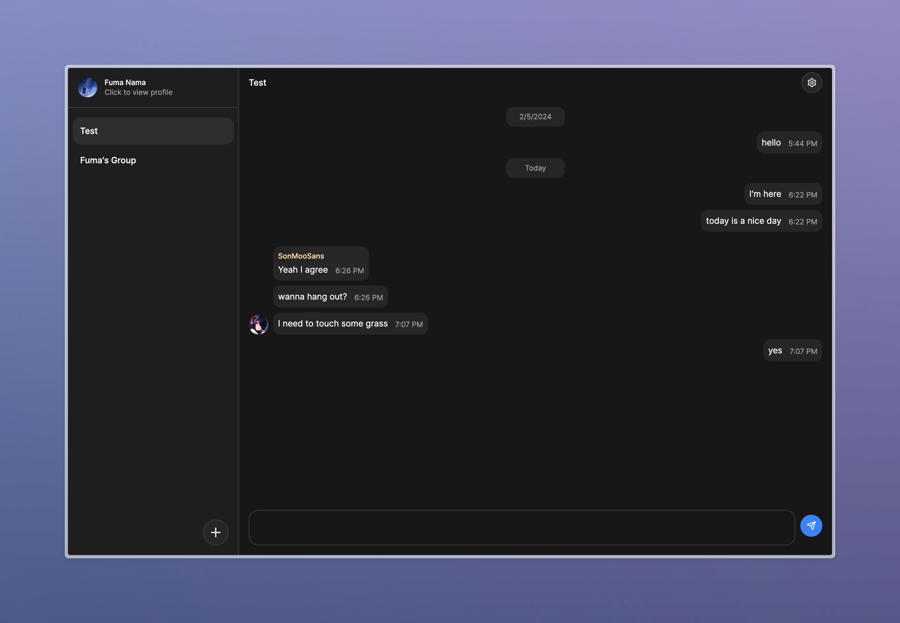

## Fuma Chat

This is a project experimenting Next.js App Router on a complex client-side realtime application.
Built with Neon Database, Pusher Realtime and Radix UI.

Want to see a full-powered chat app? Check [Shark Chat](https://shark-chat.vercel.app).



### Run

Install dependencies.

```bash
pnpm i
```

Put credentials in `.env.local`, the needed environment variables are listed in `.env.local.example`.

| Command                |                            |
|------------------------|----------------------------|
| Run in production mode | `pnpm build && pnpm start` |
| Run in dev mode        | `pnpm dev`                 |  